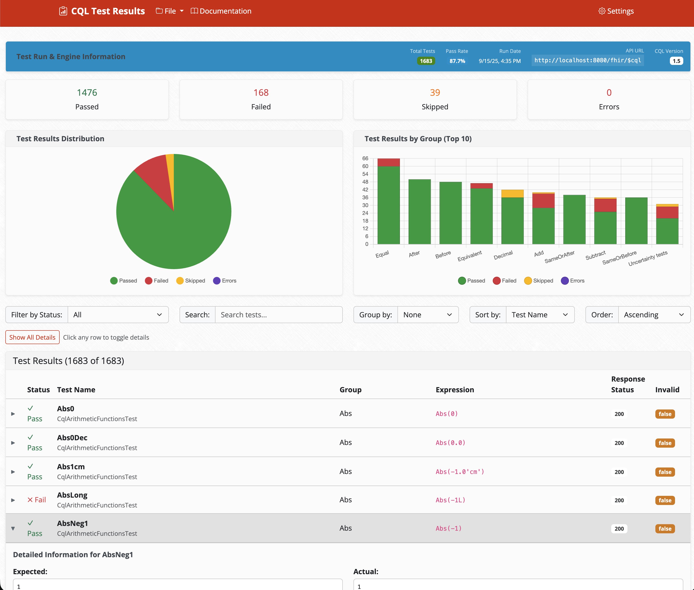
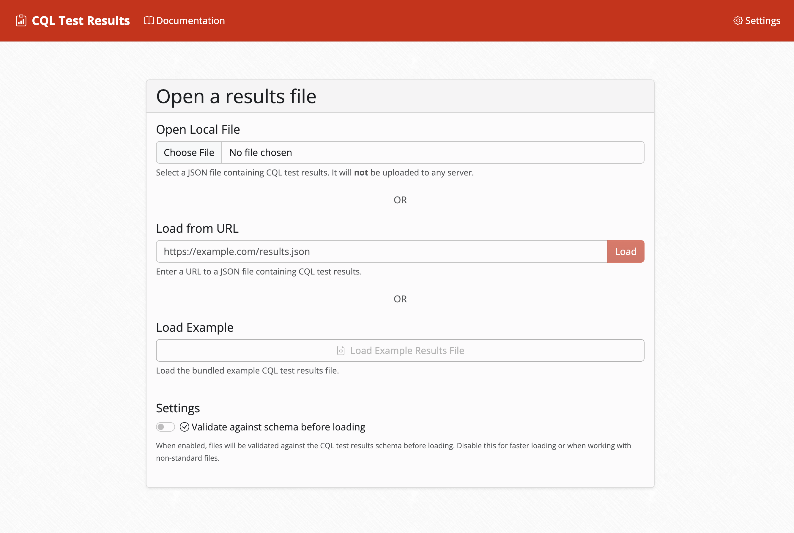
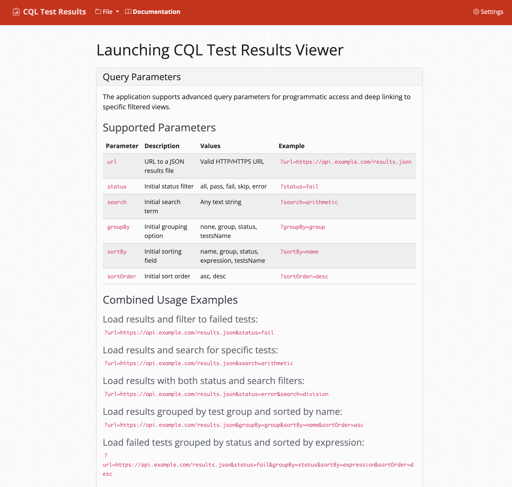

# CQL Tests UI

**This project has been contributed to `cqframework` at https://github.com/cqframework/cql-tests-ui!** This original version will be archived.

A web application for viewing and analyzing CQL (Clinical Quality Language) test results created from [CQL Tests Runner](https://github.com/cqframework/cql-tests-runner/issues/40).

#### Cross-Engine Comparison Summary


#### In-Depth Result Review


#### Numerous Data Loading Options 


#### Loading w/Deep-Linking Documentation


## Quick Start with Docker

The easiest way to run this application is using Docker:

### Build and Run with Docker

```bash
# Build the Docker image
docker build -t hlseven/quality-cql-tests-ui:latest .

# Alternatively, build images for multiple architectures if supported by your build environment
docker buildx build --platform linux/arm64,linux/amd64 -t hlseven/quality-cql-tests-ui:latest .

# Run the container
docker run -p 4200:80 hlseven/quality-cql-tests-ui
```

Once the container is running, open your browser and navigate to `http://localhost:4200/`.


## Running from Source Code

### Prerequisites

- Current stable version of Node.js
- npm (comes with Node.js)

### Development Server

To start a local development server, run:

```bash
# Install dependencies
npm install

# Start the development server
npm run start
```

## Docker Details

This application uses a multi-stage Docker build:

1. **Builder Stage**: Uses Node.js 24 Alpine to install dependencies and build the Angular application
2. **Runtime Stage**: Uses Nginx Alpine to serve the built application

The Docker setup includes:
- `Dockerfile`: Multi-stage build configuration
- `nginx.conf`: Nginx configuration for serving the Angular app
- `entrypoint.sh`: Runtime configuration script

### Docker Environment Variables

The application supports runtime configuration through environment variables. The `entrypoint.sh` script processes `configuration.template.js` to generate the final configuration at runtime.

## Attribution & License

Copyright © 2025 Preston Lee. All rights reserved. Provided under the Apache 2.0 license.
